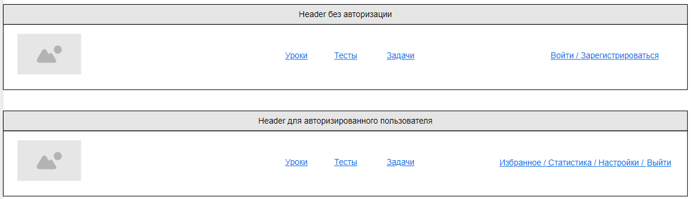
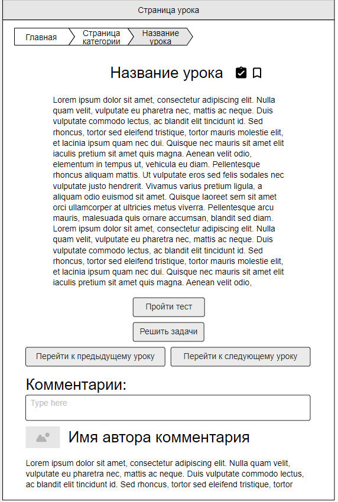

# Функционал, который планируем реализовать

## **Header с навигационной панелью**

- Header содержит навигацию по разделам
    - Присутсвует логотип и список ссылок на все страницы приложения (логотип - это ссылка на главную страницу)
    - При нажатии на ссылку из меню происходит переход на *соответствующую страницу категории*
- Header содержит пользовательскую навигацию
    - Если пользователь не авторизован, присутсвует:
        - Кнопка Войти, по нажатии на которую открывается модальное *модальное окно с формой авторизации*
        - Кнопка Регистрация, при нажатии на которую открывается *модальное окно с формой регистрации*
    - Если пользователь авторизован, присутствуют:
        - Ссылка для перехода на страницу “Избранное”, при нажатии на которую происходит переход на *страницу пользователя “Избранное”*            
        - Ссылка для перехода на страницу “Статистика”, при нажатии на которую происходит переход на *страницу пользователя “Статистика”*           
        - Ссылка для перехода на страницу “Настройки”, при нажатии на которую происходит переход на *страницу пользователя “Настройки”*            
        - Кнопка выхода из аккаунта, при нажатии на которую происходит выход из аккаунта пользователя

## **Страницы пользователя "Избранное, Статистика, Настройки"**
- *Страница “Избранное”* содержит список уроков, тестов, задач добавленных в избранное. Нажатие на значке рядом с названием должно удалять сущность из избранного.
- *Страница "Статистика”* содержит:
    - Общую статистику: сколько пройдено уроков, тестов, задач
    - Список всех модулей с индикатором их прохождения
- *Страница “Настройки”* содержит
    - Переключение темы (светлая/темная)
    - Переключение языка (русский/английский)
    - Функцию изменения пароля пользователя

## **Модальное окно с формой регистрации**

- Присутствует форма регистрации в сервисе, которая содержит
    - Поле “Имя”
    - Поле “Email”
    - Поле “Пароль”
    - Кнопку отправки формы, при нажатии на которую
        - Создается новый пользователь
        - Происходит авторизация пользователя в сервисе

## **Модальное окно с формой авторизации**

- Присутствует форма авторизации в сервисе, которая содержит
    - Поле “Email”
    - Поле “Пароль”
    - Кнопку отправки формы, при нажатии на которую
        - Отправляется запрос на сервер, с помощью которого проверяется
            - существует ли пользователь с таким email
            - правильно ли указан пароль
        - Если пользователя не существует или не верно указан пароль, выводится сообщение об этом
        - Если пользователь существует и пароль указан верно, происходит авторизация пользователя в сервисе

## **Главная страница с описанием возможностей приложения, формой регистрации и кнопкой входа в аккаунт.**

- Главная страница содержит краткое описание приложения
- Главная страница содержит пользовательскую навигацию
    - Если пользователь не авторизован, присутсвует:
        - Кнопка Войти, по нажатии на которую открывается модальное *модальное окно с формой авторизации*
        - Кнопка Регистрация, при нажатии на которую открывается *модальное окно с формой регистрации*
    - Если пользователь авторизован, присутсвуют:
        - Ссылка для перехода на страницу пользователя, при нажатии на которую происходит переход на *страницу пользователя*
        - Ссылка для перехода к следующему уроку, при нажатии на которую происходит *переход к странице урока* следующему за последним из пройденных пользователем.

## **Страница категории “Теория, Тесты, Задачи”**

- Страница категории содержит список модулей курса
- Рядом с названием модуля показан индикатор прогресса его прохождения. Прогресс рассчитывается как отношение количества всех уроков/тестов/задач модуля к пройденным урокам/тестам/задачам.
- При нажатии на модуль под ним отображается *список всех уроков/тестов/задач модуля* (и скрывается предыдущий список, если был) - аккордеон
    - Рядом с названием каждого урока/теста/блока задач есть отметка о том, был ли урок/тест/блок задач уже пройден или еще нет. Либо пройденные имеют фон/цвет текста отличающий их от не пройденных.
    - При нажатии на название урока/теста/блока задач происходит переход на *страницу этого урока/теста/блока задач*

## **Страница урока**

- Страница урока содержит:
    - "Хлебные крошки" указывающие на путь до страницы от корня сайта
    - Заголовок с названием урока
    - Индикатор показывающий, был ли урок уже пройден ранее
    - Кнопка для добавления урока в “Избранное”
    - Текст урока
    - Кнопку “Пройти тест” (если есть тест к этому уроку). При нажатии на кнопку открывается *страница теста*
    - Кнопку “Решить задачи” (если есть задачи к этому уроку). При нажатии на кнопку открывается *страница задач*.
    - Кнопку “Перейти к предыдущему уроку”. При нажатии на кнопку открывается *страница следующего урока*.
    - Кнопку “Перейти к следующему уроку”. При нажатии на кнопку открывается *страница следующего урока*.
    - Блок с комментариями пользователей к уроку. Блок содержит
        - Форму для добавления комментария. После отправки комментария он должен отобразиться в списке комментариев на странице
        - Список комментариев к статье. Он содержит: имя автора, текст комментария (дополнительно: аватарку пользователя, дату комментария)

## **Страница теста**

- Страница теста содержит:
    - "Хлебные крошки" указывающие на путь до страницы от корня сайта
    - Заголовок с названием теста
    - Индикатор показывающий, был ли тест уже пройден ранее. Если тест уже был пройден, то показывается последний результат прохождения теста
    - Кнопка для добавления теста в “Избранное”
    - Список вопросов теста. Вопрос теста содержит:
        - Номер вопроса
        - Текст вопроса
        - Блок с вариантами ответов (если у вопроса может быть только один вариант ответа - радио-баттоны, если несколько - чек-боксы)
    - Кнопку “Завершить тест”. При нажатии кнопку ответы пользователя сравниваются с верными, вычисляется количество баллов, которое набрал пользователь и после этого открывается модальное окно с результатами теста.
    - Кнопку “Решить задачи”. При нажатии на кнопку открывается *страница задач* по той же теме, что и тест.
    - Кнопку “Повторить теорию”. При нажатии на кнопку открывается *страница урока* по теме теста.
    - Кнопку “Перейти к предыдущему тесту”. При нажатии на кнопку открывается *страница следующего теста*.
    - Кнопку “Перейти к следующему тесту”. При нажатии на кнопку открывается *страница следующего теста*.

## **Страница блока задач**

- Страница блока задач содержит:
    - "Хлебные крошки" указывающие на путь до страницы от корня сайта
    - Заголовок с названием темы
    - Индикатор показывающий, был ли блок задач уже пройден ранее.
    - Кнопка для добавления блока задач в “Избранное”
    - Список задач. Задача содержит:
        - Название задачи
        - Индикатор сложности задачи
        - Текст задачи
        - Кнопку "Посмотреть решение". При нажатии на кнопку показывается модальное окно с решением задачи.
        - Кнопку "Отметить задачу решенной". При нажатии на кнопку задача помечается, как решенная пользователем.
    - Кнопку “Перейти к следующе тему”. При нажатии на кнопку открывается *страница урока* по следующей теме.
    - Кнопку “Повторить теорию”. При нажатии на кнопку открывается *страница урока* по теме задач.
    - Кнопку “Пройти тест”. При нажатии на кнопку открывается *страница теста* по той же теме, что и задачи.
    - Кнопку “Перейти к предыдущим задачам”. При нажатии на кнопку открывается *страница следующего блока задач*.
    - Кнопку “Перейти к следующим задачам”. При нажатии на кнопку открывается *страница следующего блока задач*.

## **Роутинг**

- При переходе к новой странице ссылка в адресной строке браузера изменяется на адрес текущей страницы
- Каждая страница имеет свой маршрут и открывается вне зависимости от того, посещались ли другие страницы приложения
- При переходе по несуществующему адресу открывается страница 404.